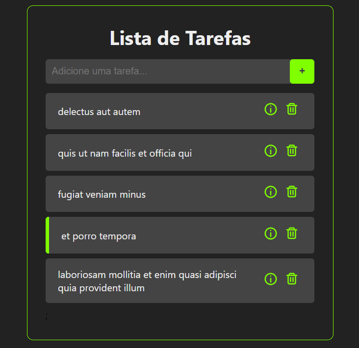
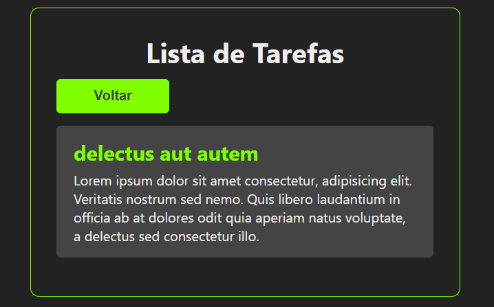

<h1 align="center">Curso de React - by Felipe Rocha  </h1>

Curso de React ministrado pelo youtuber Felipe Rocha com
projeto To Do List.

<br>

<div align="center">

  

  <br>

  

</div>

<br>

## Executar o projeto

Abra o terminal e digite os comandos:

<code>npm i</code> - Para instalar as dependências

<code>npm start</code> - Para criar o servidor da aplicação 

<br>

## Status do projeto

```Markdown
Finalizado
```

<br>

## Vídeo tutorial do projeto

```Markdown
https://www.youtube.com/watch?v=ErjWNvP6mko
```
